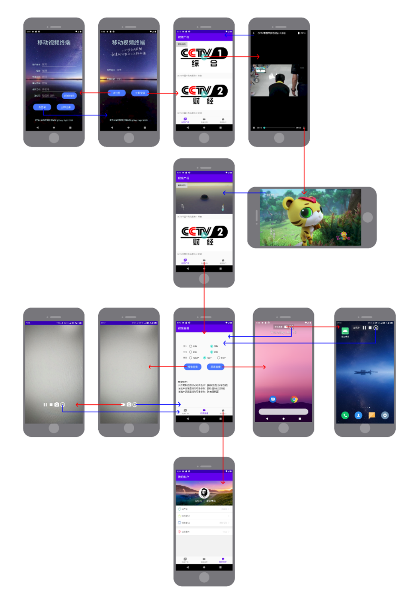

# MobileVideo

移动视频 | Android APP | RTMP直播推流 | SRS | 录屏/摄像头推流

## 应用特点

1. 用户注册及登录后端采用**Flask**框架，数据库为**Redis**，相关代码见[server/api.py](https://github.com/zys91/MobileVideo/blob/main/server/api.py)，需自行配置参数；

2. 用户注册中手机号短信验证操作采用MobSDK，需自行申请API_Key进行配置，教程详见<http://www.mob.com/wiki/detailed?wiki=SMSSDK_for_Android_kuaisujicheng>；

3. 推流器采用阿里推流SDK（V4.0.2），相关教程详见<https://help.aliyun.com/document_detail/199509.html>，根据需求移植更新到最新版本；

4. RTMP流服务器采用SRS进行搭建，相关配置文件见[server/srs.conf](https://github.com/zys91/MobileVideo/blob/main/server/srs.conf)，需自行配置，相关教程见<https://github.com/ossrs/srs/wiki/v4_CN_Home#getting-started>；

5. 拉流播放器采用[DKVideoPlayer](https://github.com/Doikki/DKVideoPlayer)，支持列表化或者滑动播放，具体部署方案详见项目地址。

## 界面展示

## 致谢

1. [SRS](https://github.com/ossrs/srs/)
2. [DKVideoPlayer](https://github.com/Doikki/DKVideoPlayer)

